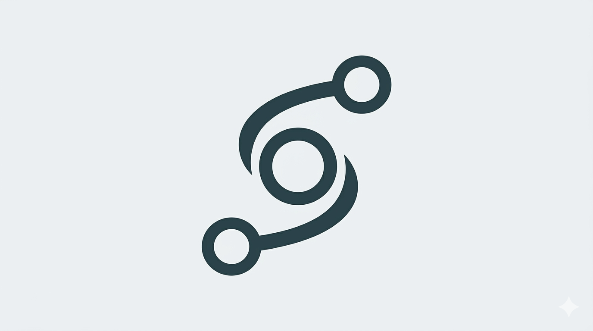
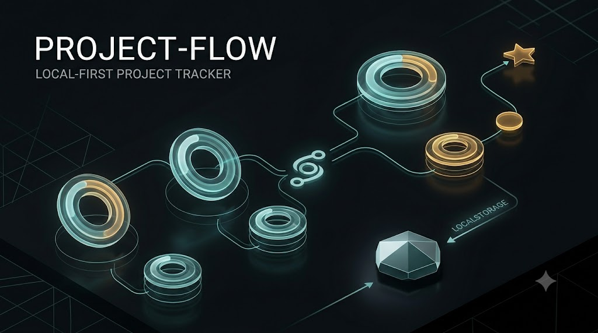
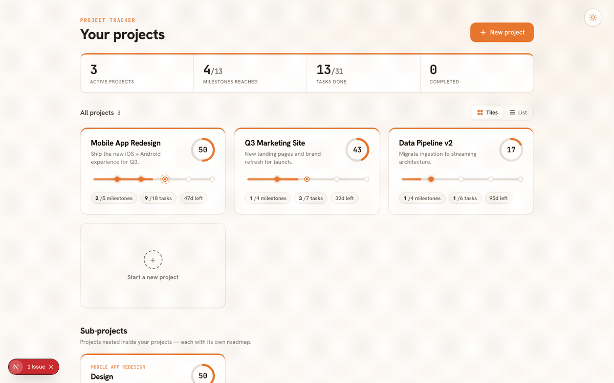

<p align="center">
  
</p>

<h1 align="center">Project Flow</h1>

<p align="center">
  A local-first project tracker with recursive milestones, visual roadmaps, and real-time cloud sync.
</p>

<p align="center">
  
  
  
  
  
</p>

<br />





---

## Overview

Project Flow is a personal project management tool built around a single idea: **every entity is a node**. Projects, milestones, and sub-projects all share the same recursive shape, so you can model any depth of work — a top-level goal containing milestones, each containing its own tracked roadmap.

Data lives in `localStorage` first. When you sign in with Google, it syncs to Firestore so your work follows you across devices. The read-only `/view` route lets you share a live snapshot of any project without exposing edit controls.

---

## Outcome
<!-- outcome -->
A roadmap and project tracking tool that supports infinitely nested projects and milestones, multiple roadmap visualizations (Track, Stations, and Stepper), and automatically calculated progress rings based on task completion. It allows nodes to be linked through dependency and relationship types, syncs data through Firestore with last-modified conflict resolution, and provides read-only shared views for any node. The application is installable as a PWA with offline support, includes persistent light/dark themes and grid/list layouts, and offers a live tweaks panel for adjusting accent colors, density, and roadmap styles.
<!-- /outcome -->
---

## Tech Stack
<!-- techstack -->
| Layer | Technology |
|---|---|
| Framework | Nextjs 15 |
| UI | React 19, TypeScript |
| Auth | Firebase Authentication — Google Sign-In |
| Database | Cloud Firestore |
| Local storage | localStorage |
| Package manager | pnpm |
<!-- /techstack -->
---

## Architecture

### Recursive Node Tree

Every entity shares one TypeScript shape:

```ts
interface ProjectNode {
  id: string;
  name: string;
  blurb: string;
  tasks: Task[];
  children: ProjectNode[];
  relations: { to: string; type: 'depends' | 'blocks' | 'related' }[];
}
```

- Nodes **with** `children` are milestones — each child has its own roadmap.
- Nodes **without** `children` are leaf nodes — they carry a task checklist.
- Recursion is unbounded: any milestone can itself contain milestones.

### Path-Based Navigation

Current location is `path: string[]` — an ordered array of IDs from root to the current node. All tree mutations (`replaceNodeAtPath`, `deleteNodeAtPath`) take a path array. Navigation is a `setPath(newArray)` call.

### Sync Strategy

```
sign-in
  └── syncOnLoad(uid)
        ├── pull Firestore doc
        ├── compare lastModified timestamps
        └── winner overwrites the loser (local or remote)

on save (any project change)
  └── pushToFirestore(uid, projects, lastModified)

on reconnect (window "online" event)
  └── push local state to Firestore
```

Local state is always written first; Firestore is a secondary mirror. If no remote doc exists, the local state bootstraps it.

### Stats Derivation

`nodeStats(node)` in `lib/data.ts` recursively derives all display data — progress %, milestone counts, completion state, and `markers[]` for roadmap rendering. It is called at render time and never cached, so keep it pure and side-effect-free.

### Read-Only Mode

`/view` and `/view/[...path]` render the same component tree as the editable app, but `readOnly: boolean` is threaded through `ProjectsShell → Dashboard / ProjectDetail`. All mutation UI is gated on that prop. `TweaksPanel` and `NewProjectModal` are not mounted in read-only mode. If a URL path does not resolve to a real node, `ViewApp` redirects to `/view`.

---

## Project Structure

```
src/
  app/
    layout.tsx               — root layout, fonts
    page.tsx                 — editable app entry
    globals.css              — CSS custom properties, base styles
    view/
      page.tsx               — read-only dashboard (/view)
      [...path]/page.tsx     — read-only detail (/view/<id>/...)
  components/
    App.tsx                  — editable shell: auth, sync, top-level state
    ViewApp.tsx              — read-only shell: navigation only
    ProjectsShell.tsx        — Dashboard-or-Detail switch, shared by both shells
    Dashboard.tsx            — project grid/list view
    ProjectDetail.tsx        — detail view for any node
    ProjectCard.tsx          — card used in grid view
    ProjectRow.tsx           — row used in list view
    Roadmap.tsx              — track / stations / stepper variants
    Ring.tsx                 — circular progress ring
    Modal.tsx                — base modal shell
    NewProjectModal.tsx      — create project flow
    TweaksPanel.tsx          — floating tweaks panel + useTweaks hook
    ThemeToggle.tsx          — light/dark toggle
    SignInScreen.tsx         — Google sign-in gate
  lib/
    data.ts                  — data model, persistence, tree helpers, nodeStats
    types.ts                 — shared TypeScript types
    firebase.ts              — Firebase init, auth helpers, dev bypass
    sync.ts                  — Firestore push/pull/sync logic
assets/
  cover.jpeg                 — cover image
  logo.png                   — app logo
docs/
  superpowers/
    specs/                   — design specs
    plans/                   — implementation plans
samples/                     — original standalone HTML prototype (not the active codebase)
```

---

## Getting Started

### Prerequisites

- Node.js 20+
- pnpm (`npm i -g pnpm`)
- A Firebase project with Firestore and Google Auth enabled (or use dev bypass — see below)

### Install & run

```bash
pnpm install
pnpm dev
```

Opens at `http://localhost:3000`. Demo data is seeded automatically on first load.

### Environment variables

Copy `.env.example` to `.env.local` and fill in your values:

```bash
cp .env.example .env.local
```

#### Skip Firebase for local dev

Set `NEXT_PUBLIC_DEV_BYPASS_AUTH=true` to skip Google sign-in entirely and use a local `dev-user`. No Firebase project needed — demo data seeds from `localStorage`.

#### Full Firebase setup

If you want real auth and Firestore sync, you need a Firebase project. Each step below links to the relevant console page.

**1. Create a Firebase project**

Go to [console.firebase.google.com](https://console.firebase.google.com) → **Add project**. Give it a name, disable Google Analytics if you don't need it, and click through.

**2. Register a web app**

In your project: **Project Settings** (gear icon) → **Your apps** → click the `</>` (Web) icon → register the app. After registering, Firebase shows you a config object like:

```js
const firebaseConfig = {
  apiKey: "...",
  authDomain: "...",
  projectId: "...",
  storageBucket: "...",
  messagingSenderId: "...",
  appId: "...",
  measurementId: "..."   // only if you enabled Analytics
};
```

Copy these values into `.env.local`:

| Variable | Where it comes from |
|---|---|
| `NEXT_PUBLIC_FIREBASE_API_KEY` | `apiKey` |
| `NEXT_PUBLIC_FIREBASE_AUTH_DOMAIN` | `authDomain` |
| `NEXT_PUBLIC_FIREBASE_PROJECT_ID` | `projectId` |
| `NEXT_PUBLIC_FIREBASE_STORAGE_BUCKET` | `storageBucket` |
| `NEXT_PUBLIC_FIREBASE_MESSAGING_SENDER_ID` | `messagingSenderId` |
| `NEXT_PUBLIC_FIREBASE_APP_ID` | `appId` |
| `NEXT_PUBLIC_FIREBASE_MEASUREMENT_ID` | `measurementId` (optional) |

**3. Enable Google Sign-In**

**Authentication** → **Sign-in method** → **Google** → toggle **Enable** → save.

Then under **Authentication** → **Settings** → **Authorized domains**, add `localhost` if it isn't already listed (required for sign-in to work during local development).

**4. Create a Firestore database**

**Firestore Database** → **Create database** → choose **production mode** → pick a region close to you → done. Start in production mode; the app uses per-user paths (`users/{uid}/data/projects`) and you can set rules later.

**5. Get your Owner UID**

`NEXT_PUBLIC_FIREBASE_OWNER_UID` restricts sign-in to a single user (you). To find your UID:

1. Run the app with the Firebase config in place and `DEV_BYPASS_AUTH=false`.
2. Sign in with Google.
3. Go to **Authentication** → **Users** in the Firebase Console — your UID is listed in the **User UID** column.
4. Paste it into `.env.local` as `NEXT_PUBLIC_FIREBASE_OWNER_UID`.

If this variable is left empty, any Google-authenticated user can sign in.

---

## Routes

| Path | Description |
|---|---|
| `/` | Editable dashboard and project detail |
| `/view` | Read-only dashboard (shareable) |
| `/view/<id>/...` | Read-only detail for any node in the tree |

---

## Scripts

```bash
pnpm dev          # start dev server
pnpm build        # production build
pnpm start        # serve production build
pnpm type-check   # TypeScript check without emitting
```
